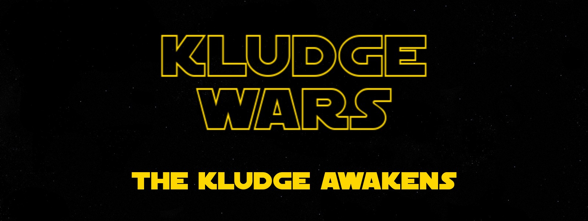

Please note: 
1. This project is only available on Windows machines, as it is dependant on the .NET framework
2. This project is no longer being updated, though it may be revived in the future.

### Install instructions:

- Step 1: Download the installer here: <a href="./Test_Installer_KludgeWars/Kludge_Wars_Setup.msi" download>Kludge Wars Setup</a>

- Step 2: Run the installer. Your machine will ask for administrator privelege to do so.

- Step 3: navigate to wherever the game was installed and run 'OOP2_Major_mockup_PRJ.exe' 

---

### How to play

This Game is a Choose your own Adventure style story-based game. Read some stuff, make a choice, manage  your resources, rinse, repeat. The length of the story is somewhat short, though there is some procedurally generated content mixed in. The systems are in place to expand the story rapidly, if we choose to continue this project at a later date. More on project scope later. 

#### Player Controls:

- The 'Board ship' button lets the user change between being on the ship or outside of it, as appropriate
- The 2-5 buttons displayed in the flow panel below the story text allow the user to make dialog choices. A choice must be made each turn before proceeding to the next.
- The 'Warp' button proceeds to the next turn. One of the status labels will show when this is possible by displaying the ship's name (the Delta)
- The items displayed in the inventory will have their effects applied and dissapear on click, even if there is no need (i.e. the user can expend a health pack while at full health). Manage resources accordingly.
- The score in the game is 'Distance Travelled', or the number of turns survived. The game has not been balanced very much, ie. the user will usually die from ship damage ~ 15 turns in or so, even if they are careful.  

---

### What we learned

#### Sam (sturcott3)

Kludge Wars was my first attempt at designing something from the ground up. While it is certainly not the most recent or technically advanced of my projects, I feel that it is a great example of how I approached school: 200% effort on everything. Kludge Wars started as a mid-term assignment for Object-Oriented programming 2, in the second semester of college. In the preceeding few weeks, we had been introduced to classes for the first time. 

Mat and I decided to go nuts, because we were doing quite well in our other courses and we thought we had time to spare. We decided to attempt a fully functional choose-your-own adventure game in 6 weeks. After throwing out the first version of the codebase halfway through the project, we learned the hard way that project scope should be planned around what is realistic to complete in a given time frame, and not by lofty aspirations. 

In hindsight, starting out with an idea as big as we did was not a great decision considering the timeframe/expected effort to complete this project was a single course. While we completed a very large portion of what we set out to do, the goals we began with were a little unrealistic. 
  
This was also my first experience sharing code with another programmer, which is another kettle of fish entirely. Luckily, I was fortunate enough to work with another strong student. This project was an excellent reminder to remove my ego from the process. This is something I do not usually have trouble with, but I now see that I will have to be careful not to let projects become too much 'my baby'.
  
 #### Matt (mathew118)
 
It was an interesting experience working on this project, it taught me how to work with Git as well as working on a codebase with others. Secondly it taught me to design my code to be more object-oriented rather than single-use classes. Project scope was also an issue initially on this project, and going forward I would limit those very ambitious goals and set realistic ones based on the time-scale of the project.
